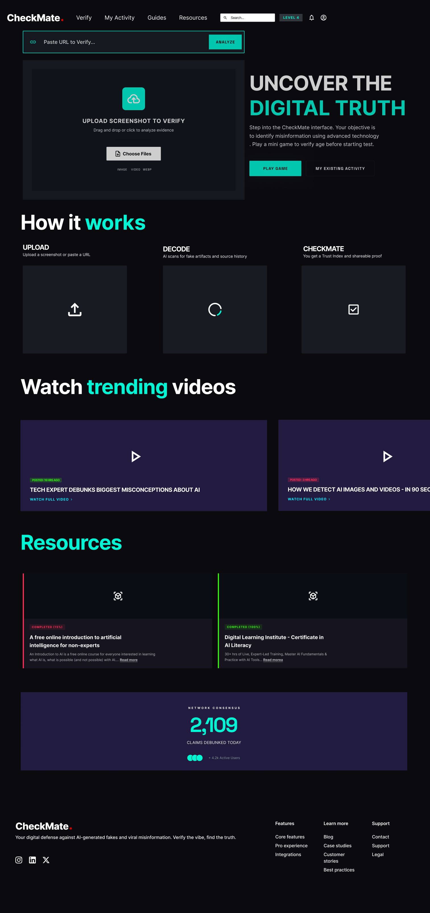
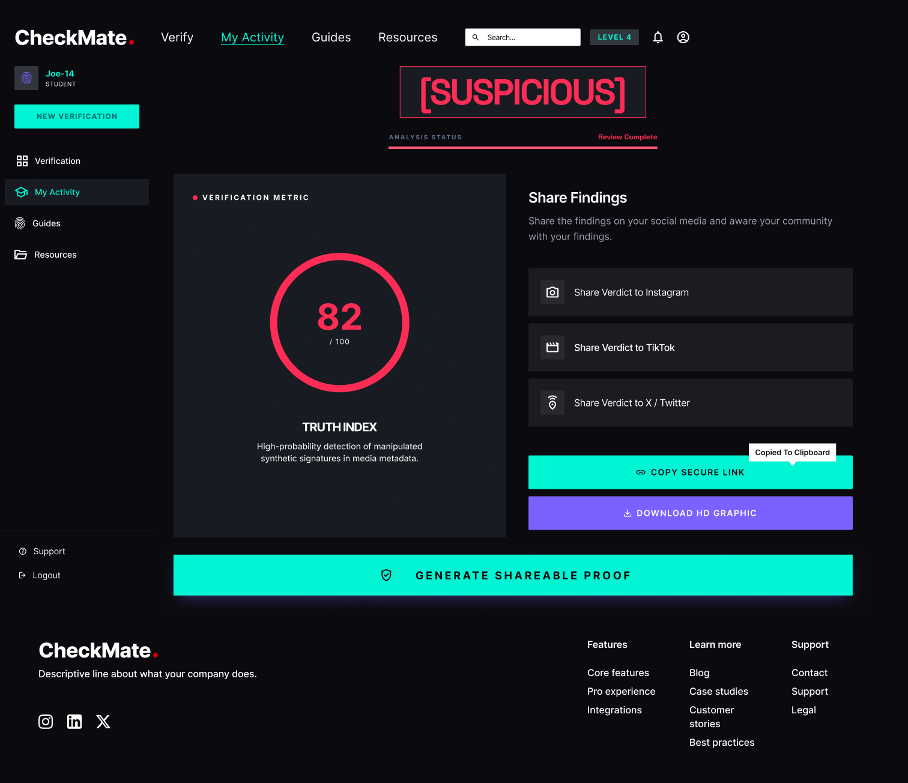
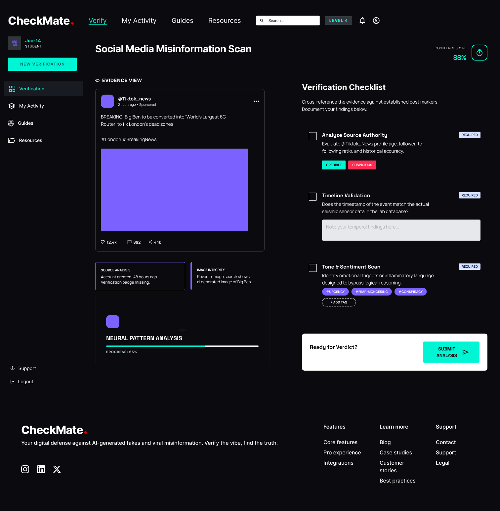

# ♟️ Checkmate — AI Misinformation & Fake Data Detector

> A UI/UX design case study created to help students detect AI-generated misinformation, synthetic data, and unverified claims in academic content.

---

### 🎥 Interactive Prototype Demo

---

### 🔗 Interactive Design Links
* 🎨 **[Click Here to Play Interactive Figma Prototype](https://www.figma.com/proto/U53YpC8H5WruJeSspDhyqY/Checkmate.?node-id=41-2052&p=f&t=YxIRO9KI3tvZE5h8-0&scaling=scale-down&content-scaling=fixed&page-id=0%3A1&starting-point-node-id=11%3A861)**

---

## 📌 Project Overview
Students frequently encounter AI-generated text and online sources without clear indicators of data accuracy or source credibility. **Checkmate** provides an intuitive interface that highlights questionable claims, flags synthetic data, and guides students through checking sources without overwhelming technical jargon.

---

## 💡 Key Features
* **Real-time Misinformation Flagging:** Color-coded confidence ratings for statistics and online content.
* **Source Inspector:** Quick breakdown letting students cross-reference cited material.
* **Student-Centric UX:** Educational prompts explaining *why* content was flagged in accessible language.

---

## 📸 Interface Designs & Screenshots

| Landing Page | Activity & Dashboard |
| :---: | :---: |
|  |  |

| Test & Detection Screen |
| :---: |
|  |

---

## 🛠️ Tools & Methodology
* **Design Tool:** Figma (Wireframing, UI Design, Interactive Prototyping)
* **Target Audience:** Students and academic researchers